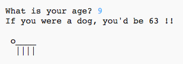

---
title: 关于我
level: Python 1
language: zh-CN
stylesheet: python
embeds: "*.png"
materials: ["project-resources/new/*.*", "volunteer-resources/about-me-finished/*.*"]
...

#简介:  { .intro}

通过这个项目你将学到如何利用Python程序向人们介绍你自己。
 

  <iframe src="https://trinket.io/embed/python/a1f663ae0d?outputOnly=true&start=result" width="600" height="500" frameborder="0" marginwidth="0" marginheight="0" allowfullscreen>
  </iframe>
  

#Step 1: 打个招呼 { .activity}

让我们从写些文字开始。

## Activity Checklist { .check}

+ 打开一个空白的[Trinket](http://jumpto.cc/python-new) Python模板: <a href="http://jumpto.cc/python-new" target="_blank">jumpto.cc/python-new</a>。如果你在线，也可以使用下面内嵌在网页里的trinket。

<iframe src="https://trinket.io/embed/python/33e5c3b81b?start=result" width="100%" height="400" frameborder="0" marginwidth="0" marginheight="0" allowfullscreen></iframe>

+ 输入下图中的代码：

    

    `#!/bin/python3` 这句魔法指令告诉Trinket我们使用Python 3 (最新的版本)解释器.

+ 点击 'run', 你将会看到 `print()` 命令将引号`''`之间的内容全部打印出来。

    

+ 如果代码中有错误，你将会得到一个错误提示 -- 告诉你哪里出错了! 

    试一下！删除结尾的引号 `'` 或者括号 `)` (或者2个都去掉) 看会发生什么。

    

+ 还原刚刚删除的引号或括号，再次点击'运行'按钮，确保程序能够正常工作。

## 保存项目 {.save}

__保存Trinket项目不需要Trinket账号!__ 

如果你还没有Trinket账号，点击下箭头然后选择'Link'，系统会给你一个链接。你可以将这个链接保存下来，下次直接点击这个连接就可以回到上次的状态。 你每次保存项目后都需要获取一次链接，因为链接会随着保存而变化！

如果你有Trinket账户，你可以点击'remix'将Trinket项目保存为你自己的版本。

## 挑战: 你在想什么? { .challenge}
修改上面的代码，打印一些你认为有趣的信息！

## 保存项目 {.save}

#Step 2: ASCII字符画 { .activity}

让我们打印一些比文本有趣的多的东西… ASCII字符画! ASCII字符画 (发音 '_ask-e_') 意思是通过 __字符创建图画__。

## Activity Checklist { .check}

+ 让我们为程序添加点艺术元素 - 一只小狗!

    

+ 点击'运行'，你会发现新代码里有个bug。

    

    这是因为文本中包含了一个引号，Python认为这表示字符串结束！

     

+ 要修复这个bug，只需要在`here's`中的引号前面加上一个斜杠 `\` ， 告诉Python这个引号是文本的一部分。

    

+ 如果你愿意，你还可以使用3引号 `'''` 代替单引号，这样你就可以在一个`print`语句中打印多行文本了:

    

## 保存项目 {.save}

## 挑战: 关于你自己 { .challenge}
写一个Python程序用文本和ASCII字符画向别人介绍你自己。你可以创建你的爱好，你的朋友...或者任何你想表现的字符画！

__注意：你写在Trinket中的代码是公开的。不要写你的名字、地址等隐私信息！__

举个栗子:

## 保存项目 {.save}

#Step 3: 2025年 { .activity}

你还可以计算并打印数字。让我们算算到2025年你多大岁数。

## Activity Checklist { .check}

+ 要计算到2025年你的年龄，你需要用2025减去你出生那年。

    向程序中添加如下代码：

    

    注意：你不需要在数字周围加上引号。

    (如果你不在`2006`年出生，你需要填入你自己的出生年份。)

+ 点击'run'，程序会打印出2025年时你的年龄。

    

+ 你可以用`input()`来改进你的程序。 `input()` 会询问用户他们的年龄并将其保存在 __变量__  `born`中.

    

+ 运行你的程序并输入你出生那年。是否会出现另一个错误信息？

    这是因为你的输入都被视为 __文本__, 需要将它转换为 __数字__。

    你可以用 `int()` 来将文本转换为 __整型__ ('整型' 就是 '整数')。

    

+ 你可以另建一个变量保存计算结果，然后再打印。

    

+ 最后，你可以加上一些有用的注释让程序更容易理解。

    

## 保存项目 {.save}

## 挑战: 狗年纪年年龄 { .challenge}
写一个程序询问用户年龄，然后告诉用户按照狗年纪年他们的年龄是多少！人的真实年龄乘以7就是他的狗年纪年年龄。

在编程语言里， __乘号__ 用 `*` 表示，通常点击 __shift+8__ 输入。

## 保存项目 {.save}

## 挑战: 文本计算 { .challenge}
你知道吗？文本也能计算!

下面的代码会在屏幕上打印出什么来？看看你在代码运行之前能不能猜出来。

你能编出你自己的句子吗？你甚至可以创造出自己的图案！

## 保存项目 {.save}

