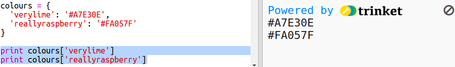

---
title: 五彩缤纷
level: Python 1
language: zh-CN
stylesheet: python
embeds: "*.png"
materials: ["project-resources/new/*.*", "volunteer-resources/colourful-creations-finished/*.*"]
...

# Introduction { .intro}

在这个项目中，你将创建一个颜色字典，将难以记忆的颜色代码映射到易于理解的颜色名。

  <iframe src="https://trinket.io/embed/python/41a99e668b?outputOnly=true&start=result" width="600" height="500" frameborder="0" marginwidth="0" marginheight="0" allowfullscreen>
  </iframe>
  

# 第1步: 使用十六进制颜色代码 { .activity}

## Activity Checklist { .check}

Python 中的乌龟绘图预置了一些颜色，例如 'red'(红色) 和 'white'(白色) ，但是你也可以使用十六进制颜色代码 (在HTML和CSS课程中你可能已经见过这些颜色代码。)

+ 打开一个空白 Python 项目: <a href="http://jumpto.cc/python-new" target="_blank">jumpto.cc/python-new</a>。如果你是在线学习，你也可以使用下面的内嵌版本。

<iframe src="https://trinket.io/embed/python/33e5c3b81b?start=result" width="100%" height="600" frameborder="0" marginwidth="0" marginheight="0" allowfullscreen></iframe>

+ 加入下面代码设置乌龟绘图:

    

    注意这里使用了颜色名字: 'white'（白色）。

+ 乌龟绘图有一系列颜色可以使用，但有些时候你想要使用自己的颜色。乌龟绘图同样可以使用十六进制颜色代码。

  打开 <a href="http://jumpto.cc/colour-picker" target="_blank">jumpto.cc/colour-picker</a> 并选择你喜欢的颜色。你会发现十六进制颜色代码都是以 '#' 开头，例如'#A7E30E'.

+ 选中十六进制颜色代码，包括前面的井号， 点击鼠标右键然后选择复制，或者点击键盘 Ctrl-C，复制颜色代码。

+ 然后修改代码，用你选择的颜色填充屏幕。 例如:

   

   你可以点击鼠标右键然后粘贴或点击键盘 Ctrl-V 将颜色代码粘贴到trinket中。

+ 选择另一个颜色代码并用它来绘制带颜色的文字:

   

   你不必非要用 'Arial' 字体，你可以尝试使用 'Verdana', 'Times' 或 'Courier' 等字体。

   '40' 是字体的大小，你也可以尝试修改这个值。

+ 尝试不同的颜色，直到你觉得两个颜色放在一起非常美观。

## 保存项目 {.save}

# 第2步: 颜色字典 { .activity}

## Activity Checklist { .check}

使用十六进制颜色值非常灵活，但缺点是很难记忆。

就像你已经了解到的那样，字典可以查找一个词然后看他的意思。Python中的字典字典比现实中的字典更加的灵活 - 你可以通过任意'key'(键)查找对应的'value'(值)。

让我们创建一个字典，将人类易读的颜色名(键) 与计算机处理方便的十六进制颜色值(值)关联起来。

+ 字典使用花括号记录内容。

  创建一个名为 `colours` 的字典：

   

+ 为你的颜色起一个酷酷的名字，然后编辑 `colours = {} ` ，将颜色名和颜色值加入到字典。

  例如:

   

   冒号 `:` 将键(颜色名)和值(十六进制颜色代码)分开。每组 键:值对 之间用逗号 `,` 分隔。

+ 现在不不需要记十六进制颜色代码了，你只需要从字典里查找颜色名就能得到这些颜色代码。

  用你的颜色名调整下面的代码：

  

  字典后加方括号'[]'，键放在方括号中。

+ 现在你可以更新代码，通过查找字典查找颜色:

  

+ 测试你的程序，确保文字依然能够正确显示。

## 保存项目 {.save}

## 挑战: 更多颜色! {.挑战}

你能向字典中加入更多的颜色并查找使用它们吗？ 用 <a href="http://jumpto.cc/colour-picker" target="_blank">jumpto.cc/colour-picker</a> 寻找更多颜色。

不要忘了给你的颜色起一个牛逼的名字。

下面的例子向你演示如何使用乌龟绘图：

## 保存项目 {.save}

## 挑战: 创建海报

设计师通常会将一个特定主题的配色创建成颜色板，比如沙漠或太空。

你能新建一个Python工程并用字典创建某个主题颜色板吗？你可以选择秋天、森林、海洋、圣诞、冰淇淋、你钟爱的球队颜色或任何你喜欢的主题。

用你的主题颜色版字典创建一张海报。

你可以使用其他你直到的乌龟绘图屏幕命令，例如 `forward`, `right`, `left`, `penup` 和 `pendown` 等。

也许你可以为你的海报加上边框?

其他有用的乌龟绘图命令如下:

+ `circle(50)` 画一个半径50的圆。
+ `dot(100)` 画一个直径100的实心圆（点）。

下面是一个例子:

## 保存项目 {.save}