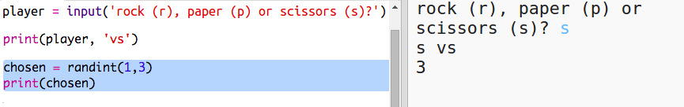
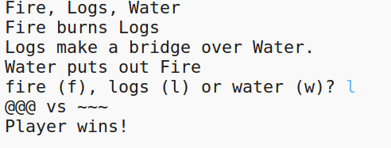

---
title: 石头，剪刀，布
level: Python 1
language: zh-CN
stylesheet: python
embeds: "*.png"
materials: ["project-resources/rock-paper-scissors/*.*", "volunteer-resources/rock-paper-scissors-finished/*.*"]
...

# 简介 { .intro}

在这个项目中，你将创建一个石头，剪刀，布游戏，并与电脑一决胜负。 

规则：你和电脑同时出石头、剪刀或布中的一种，胜负规则如下：

+ 石头砸剪刀
+ 布包石头
+ 剪刀剪布

<div class="trinket">
  <iframe src="https://trinket.io/embed/python/e1e1d873be?outputOnly=true&start=result" width="600" height="500" frameborder="0" marginwidth="0" marginheight="0" allowfullscreen>
  </iframe>
  
</div>

# 第1步: 玩家回合 { .activity}

首先，让玩家选择石头、剪刀或布。 

## Activity Checklist { .check}

+ 打开trinket: <a href="http://jumpto.cc/rps-go" target="_blank">jumpto.cc/rps-go</a>. 如果你正在线学习，你也可以使用下面的嵌入版。
<div class="trinket">
<iframe src="https://trinket.io/embed/python/de918c4f5d?start=result" width="100%" height="600" frameborder="0" marginwidth="0" marginheight="0" allowfullscreen></iframe>
</div>

+ 这个项目已经将你即将用到的函数导入到了工程中。

  
  
  后面你将使用 `randint` 生成随机数。

+ 首先，让玩家通过输入'r', 'p' 或 's'来选择石头、剪刀或布。 

  
  
+ 然后将玩家的选择打印出来：

  
  
+ 点击`Run`测试你的代码。点击trinket的输出窗口并输入你的选择。

# 第2步: 电脑回合 { .activity}

现在轮到电脑出了。你可以用 `randint` 函数生成一个随机数来决定电脑出石头还是剪刀还是布。

## Activity Checklist { .check}  


+ 用 `randint` 函数生成一个随机数来决定电脑出石头还是剪刀还是布。

  
  
+ 反复运行多次 (每次你都需要输入'r', 'p' or 's')
  
  你会发现'chosen' 会在 1, 2, 3之间随机选择。 
  
+ 假设:
  
  + 1 = 石头 (r)
  + 2 = 布 (p)
  + 3 = 剪刀 (s)

  使用 `if` 语句来判断随机生成的数字是不是 `1` (`==` 用于比较两个东西是否相等)。 
  
  
  
+ Python 使用 __缩进__ (将代码向右移动) 来表示哪些代码在 `if` 中。你可以用两个空格 (敲击空格键2次) 或点击 __tab 键__ (通常在 CAPSLOCK 键上方) 来缩进。

  使用缩进，在 `if` 代码块中，将 `computer` 设为 'r' ：
  
  
  
+ 你可以使用 `elif` (_else if_ 的缩写) 添加另一个判断:

  

  这个条件判断仅当第一个判断失败（如果电脑没有选择`1`）时才会执行。
  
+ 最后，如果电脑既没有选择 `1` 也没有选择 `2` ，那么它必然选择了 `3`。 

  这种情况我们只需要使用 `else` 来处理其他情况： 
  
  
  
+ 现在，电脑的选择不在打印为数字，而是字母。

   
   
   你可以删除 `print(chosen)` 这一行，或者在这行开头加上 `#` 来忽略这一行（将其变为注释）。
      
+ 点击 Run 并给出你的选择来测试代码。

+ 嗯, 电脑的选择打印在新的一行。你可以在 `vs` 加入 `end=' '` 来修复这个问题, 这样就告诉Python用空格代替换行符作为输出的结尾。

   
   
   在代码开头加入 '#' 告诉 Python 不要执行这一行。 
   
   如果你测试完你的新代码，可以删除这一行。
   
+ 反复玩几次这个游戏做一下测试

  目前，你需要自己判断谁输谁赢。接下来你将添加代码让Python来怕断输赢。  
  
## 保存项目 {.save}


# 第3步: 判断输赢 { .activity}

Now let's add the code to see who won. 

## Activity Checklist { .check}

+ 你需要比较 `player` 和 `computer` 两个变量，看谁赢谁输。 

  如果两个一样，那就是平局：
  
  
  
+ 玩几局测试一下你的游戏，直到出现平局为止。 

  你需要点击 `Run` 开始一局新游戏。

+ 让我们看一下玩家出 'r' (石头) 而电脑出的不是石头的情况：

  如果电脑出的是 's' (剪刀)，则电脑输，玩家胜 (石头砸剪刀)；
  
  如果电脑出的是 'p' (布)，则电脑赢，玩家输 (布包石头)。
  
  我们可以用 `and` *同时* 判断玩家出的和电脑出的。
  
  
  
+ 接下来，让我们看一下玩家出 'p' (布) 而电脑出的不是布的情况:

  
  
+ 最后，你能自己添加代码判断玩家出 's' (剪刀) 而电脑出石头或布时，谁赢谁输吗?

+ 玩几局测试一下你的代码。 

  

  点击 `Run` 开始一句新游戏。 
  
## 保存项目 {.save}

## 挑战: ASCII 字符画 {.challenge}

你能用ASCII 字符画代替字母 r, s, p 来表示石头、剪刀、布吗？

例如:


我们让:
```
石头: O
布: ___
剪刀: >8
```

+ 你需要利用 `if` 判断每一种选择并打印对应的ASCII字符画，而不是简单的 `print computer`

提示:


+ 你需要添加一个新的if语句来判断玩家的选择并打印对应的ASCII字符画，而不是简单的 `print player` ：

提示:


记住在 `print` 语句后面加入 `end=' '` 让打印以空格结尾不以换行结尾。

## 保存项目 {.save}


## 挑战: 创建新游戏 {.challenge}

你能用其他不同的事物构造一个跟石头、剪刀、布类似的游戏吗？

点击'Duplicate'按钮复制一份石头、剪刀、布工程代码，以此为基础，创建你自己的游戏吧。

这个例子使用火、木、水:



## 保存项目 {.save}
