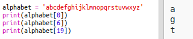
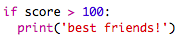

---
title: 加密信息
level: Python 1
language: zh-CN
stylesheet: python
embeds: "*.png"
materials: ["project-resources/new/*.*", "volunteer-resources/secret-messages-finished/*.*", "volunteer-resources/friendship-calculator-finished/*.*"]
...

# 简介  { .intro}
在这个项目中，你将学习如何开发你自己的加密程序，跟朋友之间发送和接收加密信息。
 

  <iframe src="https://trinket.io/embed/python/402256078c?outputOnly=true&start=result" width="600" height="500" frameborder="0" marginwidth="0" marginheight="0" allowfullscreen>
  </iframe>
  

# 第1步: 凯撒加密 { .activity}

加密是一种秘密代码，价格字符转换为秘文使他人无法阅读。

你将使用最古老也是最流行的加密方法， __凯撒加密__，这是以 Julius Caesar 的名字命名的加密方法。

在我们开始编码前，先让我们试着用凯撒加密来加密一个词。

## Activity Checklist { .check}

+ 隐藏词语叫做 __加密__.

	让我们先来加密字母'a'。要想加密字母'a'，我们可以将字母表画成一个圈，如下图：

	

+ 从正常文本加密的得到秘文，需要一个密钥。让我们用数字3作为密钥（其实你可以用任何你喜欢的数字）。

	要 __加密__ 字母'a'，你只需要顺时针移动3了字母，你会得到字母'd'：

	

+ 你可以使用你刚刚学到的方法加密整个单词。例如'hello'加密后变为'khoor'。你自己试一下：

	+ h + 3 = __k__
	+ e + 3 = __h__
	+ l + 3 = __o__
	+ l + 3 = __o__
	+ o + 3 = __r__

+ Getting text back to normal is called __decryption__. To decrypt a word, just subtract the key instead of adding it:

	+ k - 3 = __h__
	+ h - 3 = __e__
	+ o - 3 = __l__
	+ o - 3 = __l__
	+ r - 3 = __o__	

## 挑战: 使用凯撒加密 { .challenge}

你能给朋友发一个加密单词吗？在发送前你们两人必须先协商一个密钥。

你们甚至可以彼此发送整段加密句子！

# 第2步: 加密字母 { .activity}

让我们写一个Python程序加密单个字母。

## Activity Checklist { .check}

+ 打开一个空白Python项目: <a href="http://jumpto.cc/python-new" target="_blank">jumpto.cc/python-new</a>. 如果你是在线学习，也可以用下面的内嵌版本。

<iframe src="https://trinket.io/embed/python/33e5c3b81b?start=result" width="100%" height="600" frameborder="0" marginwidth="0" marginheight="0" allowfullscreen></iframe>

+ 我们用 `alphabet` 变量取代将字母表画成圆圈。

	

+ 字母表里的每一个字母都有一个位置，起始位置为0。所以字母'a'在字母表的第0位，字母'c'在字母表的第2位。

	

+ 你可以通过在`alphabet`变量后加方括号并将位置写入方括号内来从字母表中获取字母。

	

	当你尝试过后可以将 `print` 语句删除。

+ 接下来，你需要将密钥存入 `key` 变量。

		

+ 然后让用户输入一个字母 (存入 `character` 变量) 来加密。

	

+ 找到字母 `character` 在字母表的位置 `position`。

	

+ 你可打印出 `position` 的值来测试。例如，字母 'e' 在字母表的第4位。

	

+ 要加密用户输入字母 `character`, 你需要将密钥 `key` 加到位置 `position` 上。

	

+ 测试一下你的新代码。假设密钥 `key` 为 3，那么 `position` 会加3并保存到`newPosition` 变量。

	例如，字母 'e' 的位置位4。加密后，加上了密钥 `key` (3)，变成了7。

	

+ 当你尝试加密字母'y'时会发生什么?

	

	此时 `newPosition` 为 27，然而字母表里没有27个字母！

+ 你可以使用 `%` 告诉新的位置一旦位置达到26就回到位置0.

	

+ 最后，你需要打印出新位置上的字母。

	例如，将密钥加到字母 'e' 后得到新位置为7，字母表里位置7对应的字母为 'h'。

	

+ 测试你的代码。你可以将其他打印语句去掉，只在最后打印新字母。

	

## 保存项目 {.save}

## 挑战: Variable keys { .challenge}
修改程序，让用户可以自己输入密钥。你需要获取用户的输入，并将其保存到变量 `key` 。

记住，使用 `int()` 函数将输入转成整数。

你可以可以使用负数作为密钥来加密信息！

## 保存项目 {.save}

# 第2步: 加密整段信息 { .activity}

让我们修改程序，让它不仅仅是一次加密解密一个字母，而是加密一段完整信息！

## Activity Checklist { .check}

+ 首先，检查你的代码应该如下面这样：

	

+ 创建一个变量存储加密后的信息。

	

+ 修改代码可以存储用户的信息而不仅仅是一个字母。

	

+ 添加一个 `for` 循环，并将其他代码缩进到循环内，这样信息中的每个字母都会循环执行一次。

	

+ 测试代码。你应该看到信息中的每一个字母都被加密并打印出来。

	

+ 将每一个加密后的字母添加到 `newMessage` 变量。

	

+ 你可以在每次加密后将 `newMessage` 打印出来。

	

+ 输入你删除 `print` 语句前面的空格，加密后的信息只会在循环结束后打印一次。你也可以删除打印字符位置的语句。

	

## 保存项目 {.save}

# 第3步: 特殊字符 { .activity}

有些字符不在字母表里，这会导致错误。

## Activity Checklist { .check}

+ 让你的程序加密一条含有非字母表内字符的信息。

	例如，你可以尝试加密 `hi there!!`.

	

	注意，这条信息里的空格和 `!` 全部加密为了字母 'c'!

+ 要解决这个问题，你只需要加密那些在字母表中的字符即可。要实现这个功能，添加一个 `if` 语句，并将其他代码缩进到if语句内。

	

+ 同相同的信息测试代码，这次发生了什么？

	

	这次，你的代码直接跳过了那些不在字母表中的字符。

+ 如果程序能够不加密那些不在字母表中的字符，而是将其原模原样显示出来就好了。

	添加一个 `else` 语句，将不在字母表中的字符添加到加密信息中。

	

+ 测试你的代码。这次你会看到字母表中的字母都被加密了，不在字母表中的字符直接显示出来！

	

## 保存项目 {.save}

## 挑战: 加密解密信息 { .challenge}

加密一条信息，连同密钥一起发送给你的朋友。看看他们能不能用他们的程序解密信息！

你也可以复制一个项目并独立开发一个解密程序。

## 保存项目 {.save}

## 挑战: 友谊计算器 { .challenge}

编写一个程序通过计算友谊分来显示两个人有多默契。

这个程序会循环每一个人名字中的字母，将字母位置加到 `score` 变量中。

你需要指定一个奖励点数规则。例如，你可以奖励元音，或者出现在单词 "friend" 中的字母：

你也可以根据两人的得分给出个性化的信息：

## 保存项目 {.save}
