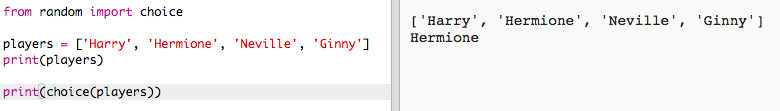
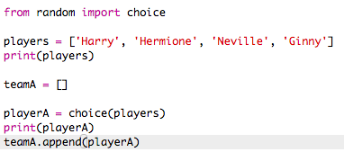
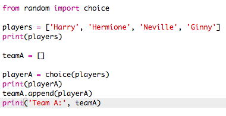
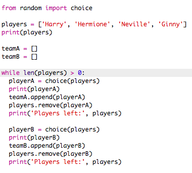
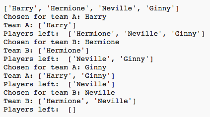
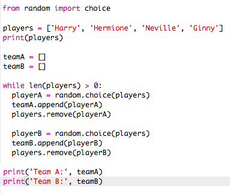
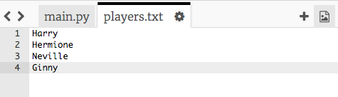
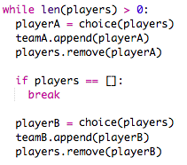

---
title: 选择队员
level: Python 1
language: zh-CN
stylesheet: python
embeds: "*.png"
materials: ["project-resources/new/*.*", "volunteer-resources/team-chooser-finished/*.*"]
...

# 简介  { .intro}
通过本项目，你将学习如何从一个队员列表中创建2只随机队伍。

  <iframe src="https://trinket.io/embed/python/a699c44ce6?outputOnly=true&start=result" width="600" height="500" frameborder="0" marginwidth="0" marginheight="0" allowfullscreen>
  </iframe>
  

# 第1步: 队员 { .activity}

首先让我们先创建队员列表。

## Activity Checklist { .check}

+ 打开一个空的Python项目: <a href="http://jumpto.cc/python-new" target="_blank">jumpto.cc/python-new</a>。如果你是在线学习，也可以用下面的潜入版本。

<iframe src="https://trinket.io/embed/python/33e5c3b81b?start=result" width="100%" height="600" frameborder="0" marginwidth="0" marginheight="0" allowfullscreen></iframe>

+ 你可以用一个 __列表__ 来存储队员。列表元素需要放在方括号`[ ]`中，并用逗号分隔。

	向程序中加入一个队员列表。

	

+ 添加如下代码打印 `players` 变量:

	

+ 你可以通过在变量名后加方括号，并在方括号中写上元素的位置来获取某个元素。

	列表的第一个元素 __位置为0__ 。这跟 Scratch 不同， Scratch从1开始。

	

## 保存项目 {.save}

## 挑战: 加入更多队员 { .challenge}
你能向列表中添加更多队员吗？你可以向列表中添加任意多队员，但要确保队员的数量是 __偶数__ 。

如果你愿意，你也可以修改前两个队员的名字。

你能只打印 __一个__ 新队员吗？

## 保存项目 {.save}

# 第2步: 随机选队员 { .activity}

让我们来随机选队员!

## Activity Checklist { .check}

+ 要想从`players`列表中随机选出一个队员，首先需要引入 `random`模块中的 `choice` 包。

	

+ 要下个得到一个随机队员，你可以用 `choice`。 (你也可以删除打印单个队员的代码)

	

+ 测试几次 `choice` 代码，你会看到每次取出不同队员。

+ 你也可以新建一个变量 `playerA`，用它来保存随机选出的队员。

	

+ 你需要一个新列表来保存所有选到队伍A的队员。一开始时，这个列表应该是空的。

	

+ 接下来你需要将随机选出的队员添加到列表 `teamA`中。 要实现这个功能，你可以用 `teamA.append` (__append__ 表示追加到列表末尾)。

	

+ 你可以用 `print` 命令打印出都谁选入了 `teamA` 列表。

	

+ 队员已经随机选出，你可以将他们从 `players` 列表中删除

	

+ 添加另一个 `print` 命令来显示 `players` 中剩下的队员。

	

	在上面的例子中， Hermione 被选入 `teamA`, 所以其从列表 `players` 中被移除了。 

## 保存项目{.save}

## 挑战: Choosing for team B { .challenge}
你能添加代码为B对随机选择队员吗？ 你需要:

+ 创建一个新的列表，名叫 `teamB`
+ 随机选择一个队员（叫`playerB`）加入`teamB`
+ 将选中的队员 `append` 到列表 `teamB`
+ 从 `players` 列表中 `remove` 掉选中的队员

为 `teamB` 添加队员的代码与你已经写的为 `teamA` 添加队员的代码 __非常__ 相似！

## 保存项目 {.save}

#第3步: 挑选多个队员 { .activity}

接下来你需要确保每个队员都能被选入一只队伍。

## Activity Checklist { .check}

+ 选中挑选A队队员和B队队员的代码，然后按tab键缩进代码。

	

+ 添加 __while__ 循环来不断选择队员直到 `players` 列表的长度为0。

	

+ 运行代码，你应该会看到队员被选进A队或B队，直到没有队员剩下。

	

+ 剪贴打印 `teamA` 列表的代码到 `while` 循环 __之后__ (确保没有缩进)

	这表示所有队员挑选完后， `teamA` 只会打印一次。

	

+ 你也可以用同样的方法打印 `teamB`，并删除其他打印语句，因为这些打印语句仅仅用于测试。

	你的代码看上去应该是这个样子：

	

+ 再次测试你的代码，你应该只会看到队员列表和最终的队伍成员。

	

## 保存项目 {.save}

#Step 4: 文件 { .activity}

你可以用文件来保存队员列表。

## Activity Checklist { .check}

+ 点击 + 图标创建一个名为 `players.txt` 的文件。

	

+ 将玩家名称添加到新文件中。确保最后一个玩家后面没有空白行。

	

+ 将 `players` 列表改为空列表。

	

+ 打来文件 `players.txt` ( `'r'` 表示只读)。

	

+ 从文件中读取列表并添加到 `players` 列表。 (代码 `splitlines` 表示文件中的每一行是 `players` 列表中的新元素).

	

+ 如果你测试代码，它应该表现得和原来一摸一样。然而，向文件 `players.txt` 添加队员更加容易。

## 保存项目 {.save}

#Step 5: 奇数队员 { .activity}

让我们改进一下程序让它能够处理奇数个队员的情况。

## Activity Checklist { .check}

+ 向 `players.txt` 文件中添加一个名字, 这样队员数量就是奇数了。

	

+ 此时运行代码，你会看到一个错误信息。

	

+ 这个错误是因为程序不断地随机挑选队员，先A队再B队。然而，如果是奇数个队员，在挑选完A队队员后，没留下队员给B队选择。

	要修复这个bug，可以当 `players` 列表为空时，用 `break` 告诉程序跳出 `while` 循环 。

	

+ 再次测试代码，你会发现现在可以处理奇数个队员的情况了。

	

## 保存项目 {.save}

## 挑战: 随机队名 { .challenge}
你能给两个队随机选个队名吗？

你可以创建一个名为 `teamNames` 的列表保存所有候选队名。

然后选择（并展示）每个对随机选到的名字。

## 保存项目 {.save}

## 挑战: 保存队名 { .challenge}
你能将队名列表保存到文件吗？

## 保存项目 {.save}

## 挑战: 更多队伍 { .challenge}
你能改进你的程序让他能够将队员分成3组吗？

## 保存项目 {.save}