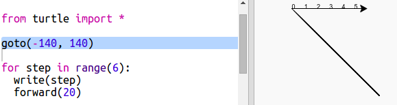
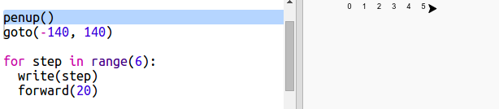
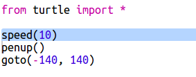
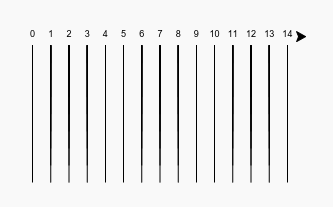
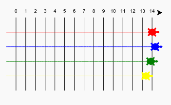

---
title: 乌龟赛跑
level: Python 1
language: zh-CN
stylesheet: python
embeds: "*.png"
materials: ["project-resources/new/*.*", "volunteer-resources/turtle-race-finished/*.*"]
...

# 简介 { .intro}

在这个项目中，你将使用循环创建一个乌龟赛跑游戏并绘制出追踪线。

  <iframe src="https://trinket.io/embed/python/9339862606?outputOnly=true&start=result" width="600" height="500" frameborder="0" marginwidth="0" marginheight="0" allowfullscreen>
  </iframe>
  

# 第1步: 跑道 { .activity}

你即将开发一个赛乌龟游戏。 首先需要画出追踪线。

## Activity Checklist { .check}

+ 打开一个空Python工程: <a href="http://jumpto.cc/python-new" target="_blank">jumpto.cc/python-new</a>. 如果你正在线学习，你也可以使用下面的嵌入版。

<iframe src="https://trinket.io/embed/python/33e5c3b81b?start=result" width="100%" height="600" frameborder="0" marginwidth="0" marginheight="0" allowfullscreen></iframe>

+ 添加如下代码，用 'turtle' 画一条直线:

  

+ 让我们用turtle画出一些追踪线。

  `write` 函数会绘制文字到屏幕上。

  测试一下:

  

+ 在两条之间之间加入数字标识:

  

+ 你发现你的代码非常啰嗦了吗？ 唯一不同的地方就是数字变了。

  其实有更妙的方法来完成这项工作。那就是 `for` 循环。

  用 `for` 循环重构你的代码:

  

+ 嗯, 数字只显示到4。在Python中 `range(5)` 返回5各数字，从 0 到 4。如果想要得到5，你需要用 `range(6)`:

  

+ 现在你可以追踪线了。turtle从屏幕中央的 (0,0) 坐标开始。

  将turtle移到屏幕左上方:

  

+ 啊，你需要先将画笔抬起来！

  

+ 这次不绘制水平线了，让我们绘制垂直线来画出追踪线：

  

+ 如果将数字居中会看起来更加整洁：

  

+ 你可以提高turtle的速度让它画得更快些：

  

## 保存项目 {.save}

## 挑战: 更多直线 {.challenge}

你能修改代码让追踪线从左向右布满屏幕吗？

如果你希望turtle走得更快些，你可以用 `speed(0)`。

# 第2步: 赛乌龟 { .activity}

接下来做点有趣的事情。让我们添加几只乌龟。如果这些乌龟每次都做同样的事情就太无聊了，所有我们让它们每次移动随机步数。100次后移动最远的乌龟获胜。

## Activity Checklist { .check}

+ 当你使用类似 `forward(20)` 的语句时你操作的是乌龟1。你可以创建多个乌龟。在代码后面添加如下代码：

  

  第一行创建了一只叫 'red' 的乌龟。后面的代码设置了这只乌龟的颜色和形状。现在他看上去像一只真的乌龟了！

+ 让我们将乌龟放到起跑线上:

  

+ 接下来你需要让乌龟每次移动随机步数。你需要从Python `random` 库中的 `randint` 函数。将这个 `import` 语句加到脚本的开头：

  

+ `randint` 函数返回给定区间内的一个随机整数。乌龟每次将移动1, 2, 3, 4, 或 5 步。

  

+ 一只乌龟无法进行比赛！让我们添加另一只：

  

  注意：移动蓝乌龟的代码需要放在 `for` 循环中，就像移动红乌龟的代码一样，确保每次都能移动2只乌龟。

## 保存项目 {.save}

## 挑战: 比赛时间! {.challenge}

现在可以开始比赛了！找一个对手挑一只乌龟比比鹿死谁手。

你能添加更多乌龟让跟多朋友可以加入游戏吗？

颜色包括: orange（橙色）, purple（紫色）, violet（紫罗兰色）, tomato（番茄色）, turquoise（天蓝色）, magenta（洋红色） 和 brown（棕色） - 或者你可以登录 <a href="http://jumpto.cc/colour-picker">jumpto.cc/colour-picker</a> 挑你喜欢的颜色。

## 保存项目 {.save}

## 挑战: 转个身 {.challenge}

你能用 `for turn in range():` 循环让每只乌龟在达到终点线后旋转360度吗？ 你需要确保开始时乌龟面向的方向是正确的！

`red.right(36)` 会将红色乌龟向右旋转36度。

**提示:** 旋转一周是360度。一只乌龟可以每次向右旋转10度，旋转36次。或者每次向左旋转5次，旋转72次...

## 挑战: 虚线 {.challenge}

你能用循环将追踪线由实线变为虚线吗？

**提示:** 找到画直线的代码。试着用:`for`, `forward()`, `penup()` 和 `pendown()`

## 保存项目 {.save}
